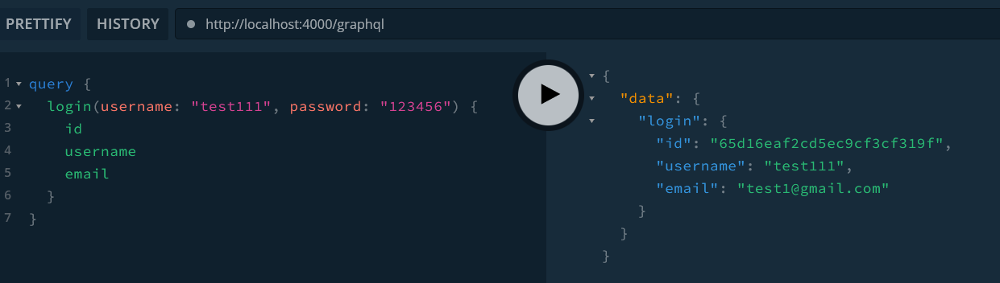
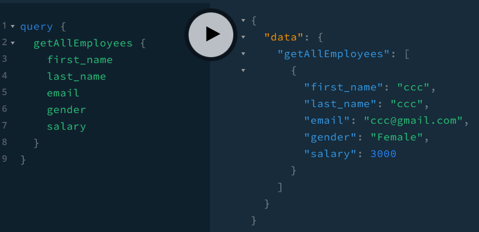
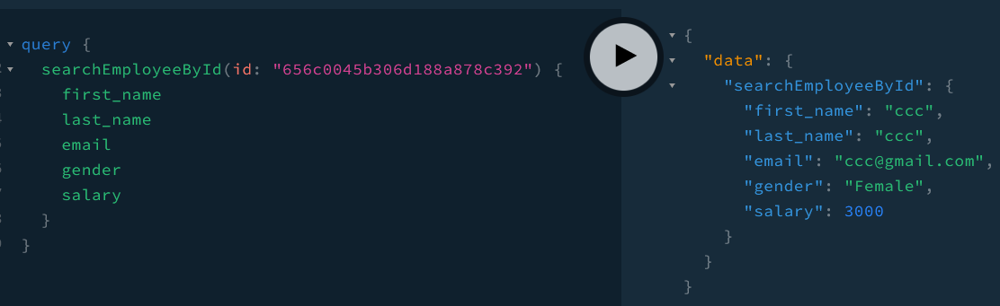
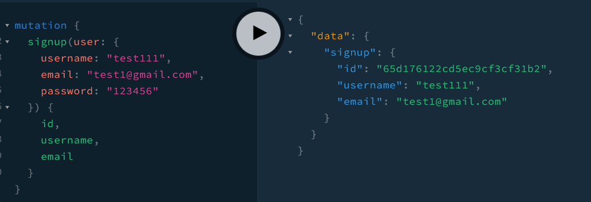
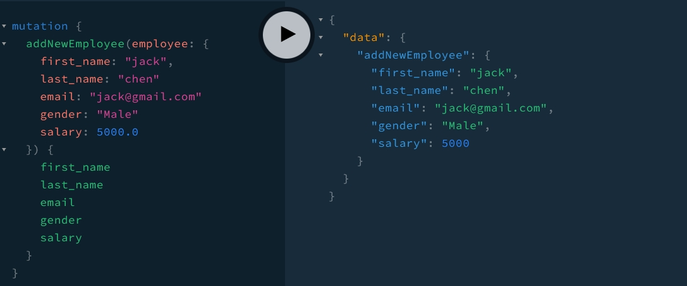
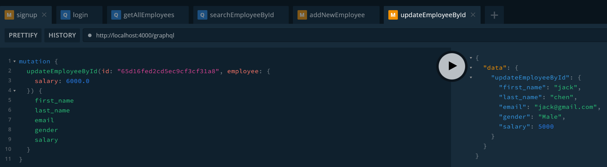
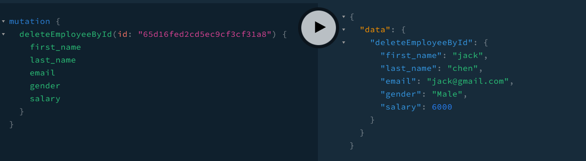

# 101304724_COMP3133_Assignment1

### How to start
```
npm install
npm run start
```

### How to use
- Open the browser and enter [http://localhost:4000/graphql](http://localhost:4000/graphql)

- Then you can write your query/mutation in the input box

### Examples
##### Login

##### Get all employees

##### Search employee by id

##### Signup

##### Create new employees

##### Update employee by id

##### Delete employee by id
